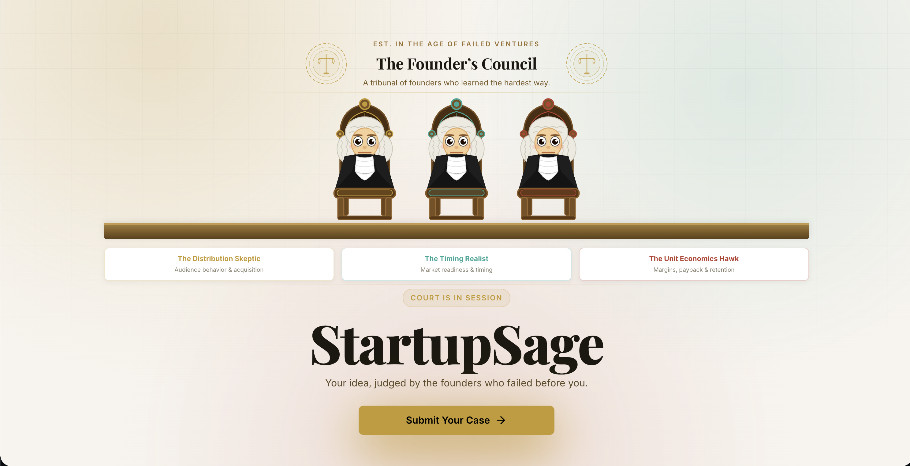
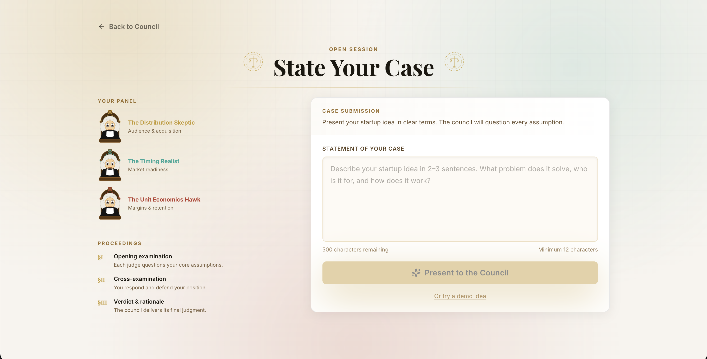
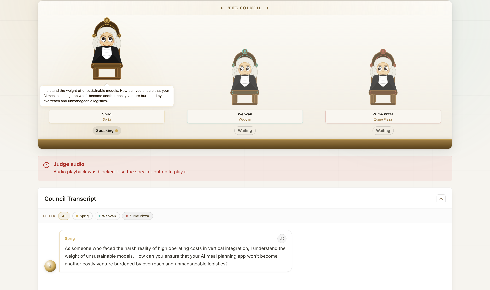
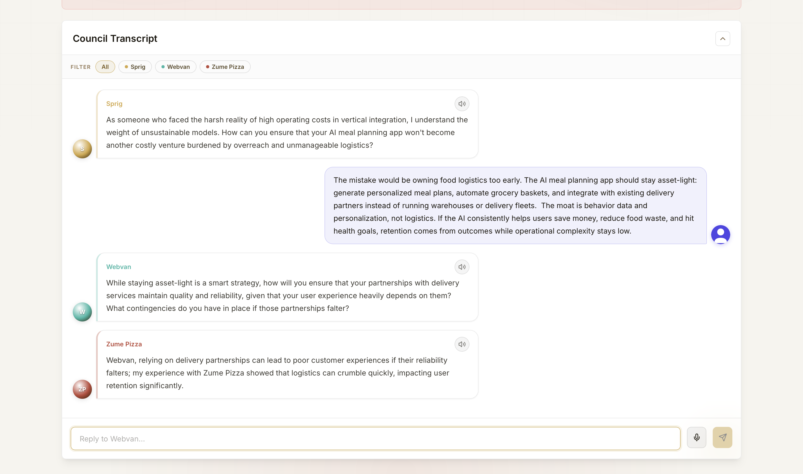
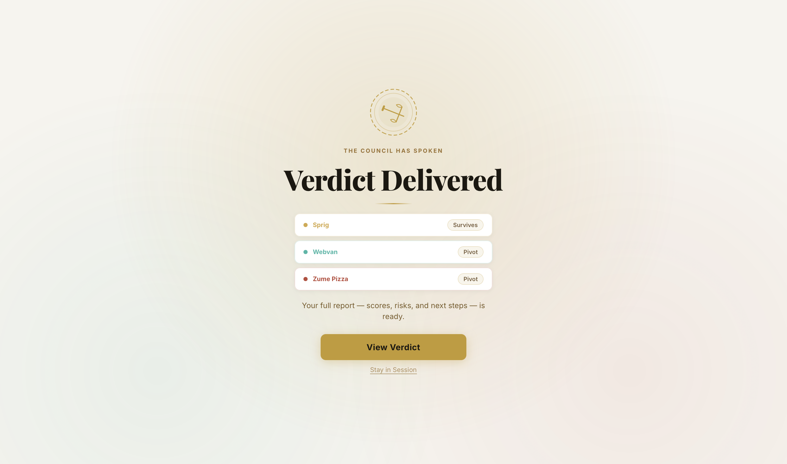
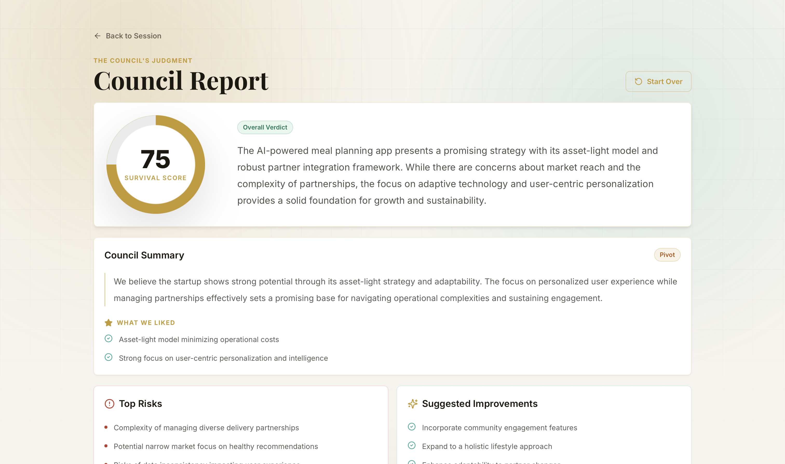

<div align="center">

<h1>StartupSage</h1>

<p><b>A tiny founder courtroom where failed-startup sages pressure-test your idea before the market does.</b></p>

<p>
Submit a startup idea, defend it live, survive the interjections, and walk away with a verdict,
risks, improvements, and a survival score.
</p>

[](https://react.dev)
[](https://fastapi.tiangolo.com)
[](https://platform.openai.com)
[](https://tailwindcss.com)

</div>

---

## Screenshots

<div align="center">
  
  &nbsp;&nbsp;
  
  <br/>
  <sub><b>Left:</b> The Founder's Council landing page &nbsp;|&nbsp; <b>Right:</b> State Your Case — idea submission screen</sub>
  <br/><br/>
  
  &nbsp;&nbsp;
  
  <br/>
  <sub><b>Left:</b> Active sage spotlight and courtroom bench &nbsp;|&nbsp; <b>Right:</b> Multi-agent transcript where sages challenge the founder and each other</sub>
  <br/><br/>
  
  &nbsp;&nbsp;
  
  <br/>
  <sub><b>Left:</b> Verdict ceremony &nbsp;|&nbsp; <b>Right:</b> Final council report with score, risks, and improvements</sub>
</div>

---

## The Premise

Every startup pitch gets torn apart eventually by VCs, customers, competitors, or time itself. StartupSage lets you face that reckoning early, inside a dramatic little courtroom, before three AI sages inspired by **historically failed startups**.

Submit your idea. Defend it under oath. Receive your verdict.

The sages are not cheerleaders. They have been burned before. Each one carries a different failure lesson, and they will keep asking the uncomfortable question until the idea either sharpens or cracks.

---

## How It Feels

```
You submit the idea
        ↓
StartupSage finds 3 relevant failed-startup parallels
        ↓
The council appears on the bench
        ↓
One judge rises, speaks, and gets the spotlight
        ↓
You answer by text or voice
        ↓
Another sage may interject if your answer opens a new risk
        ↓
The judges build on each other's objections
        ↓
They vote: Survives / Pivot / Rethink
        ↓
You get a council report with score, risks, improvements, and next steps
```

---

## Meet the Council

Three sages are dynamically assembled for each session based on your idea. StartupSage searches the failed-startup dataset, picks the most relevant cautionary parallels, and turns them into a council with distinct personalities and failure lenses.

One might care about distribution. Another might care about timing. Another might care about operational drag or unit economics. Together, they create the kind of pressure that makes a founder's assumptions easier to see.

---

## Multi-Agent Magic

StartupSage is not a single chatbot wearing three costumes. Each session creates a small adversarial council:

- **Researcher agent** selects the failed startups most relevant to the submitted idea.
- **Sage agents** each own one failure lens, such as logistics density, market timing, distribution, or unit economics.
- **Coordinator agent** watches the full transcript and decides who should speak next.
- **Report agent** turns the verdicts and transcript into a final founder-facing report.

The coordinator is the fun part. It does not simply rotate speakers in order. After every founder reply, it can:

- keep pressure on the same sage if the answer was vague
- hand the floor to a different sage when a new risk appears
- let one sage react to another sage's concern
- decide when the council has enough evidence to move into verdicts

In a live session, that can look like:

```text
Sprig asks about vertical integration and high operating costs.
Founder answers that the product will stay asset-light through partners.
Webvan interjects on partner reliability and operational readiness.
Zume Pizza follows by warning that logistics failures can damage retention.
```

Those interjections also show up visually. The active judge rises on the bench, receives the spotlight, and the reply box targets the current sage.

---

## Little Details

- **Live courtroom bench** — the speaking judge stands forward while the others wait their turn.
- **Streaming transcript** — responses appear as they are generated through Server-Sent Events.
- **Real interjections** — sages can challenge you, reinforce each other, or poke at a weak answer.
- **Voice-ready replies** — answer by text or microphone, with judge audio playback support.
- **Transcript filters** — focus on one sage or view the whole exchange.
- **Verdict ceremony** — the council reveals each vote before the full report.
- **Survival score** — a simple 0-100 read on how well the idea held up.
- **Founder report** — risks, improvements, closest historical parallel, and next steps.

---

## Under the Hood

```
┌─────────────────────────────────────────────────────────┐
│                        CLIENT                           │
│                                                         │
│  React 18 · Vite · Tailwind · TanStack Query            │
│                                                         │
│  /            → Landing                                 │
│  /submit      → Idea submission                         │
│  /session/:id → Live courtroom  (SSE streaming)         │
│  /report/:id  → Full council report                     │
└────────────────────────┬────────────────────────────────┘
                         │  HTTP + Server-Sent Events
┌────────────────────────▼────────────────────────────────┐
│                        SERVER                           │
│                                                         │
│  FastAPI · SQLite · sse-starlette                       │
│                                                         │
│  Sessions, messages, verdicts → SQLite                  │
│  Real-time events → asyncio.Queue → SSE stream          │
└────────────────────────┬────────────────────────────────┘
                         │
┌────────────────────────▼────────────────────────────────┐
│                     AGENT LAYER                         │
│                                                         │
│  Researcher      → identifies 3 relevant failed          │
│                    founder archetypes via GPT-4o mini    │
│                                                         │
│  Coordinator     → decides who speaks next based on     │
│                    transcript context, dodged answers,   │
│                    and coverage across risk lenses       │
│                                                         │
│  SageAgent (×3)  → streams adversarial questions and    │
│                    interjections, then delivers verdicts │
│                                                         │
│  ReportGenerator → synthesises the full council         │
│                    report using GPT-4o / GPT-4o mini     │
└─────────────────────────────────────────────────────────┘
```

---

## Quickstart

### Prerequisites

- Node.js 18+
- Python 3.11+
- An [OpenAI API key](https://platform.openai.com/api-keys)

### 1. Clone

```bash
git clone https://github.com/your-org/startupsage.git
cd startupsage
```

### 2. Backend

```bash
cd server
python -m venv .venv
source .venv/bin/activate          # Windows: .venv\Scripts\activate
pip install -r requirements.txt
pip install -r requirements-ai.txt
```

Add your OpenAI key:

```bash
cp .env.example .env
# Open .env and set OPENAI_API_KEY=your_key_here
```

Start the server:

```bash
uvicorn main:app --reload --port 8000
```

Verify it's running:

```bash
curl http://localhost:8000/health
# → {"status":"ok"}
```

### 3. Frontend

```bash
cd client
npm install
npm run dev
```

Open **http://localhost:5173** (or whichever port Vite prints).

---

## Environment Variables

### Server — `server/.env`

| Variable | Required | Description |
|---|---|---|
| `OPENAI_API_KEY` | Yes | OpenAI API key |
| `DATABASE_PATH` | No | Path to SQLite database file |
| `OPENAI_TRANSCRIPTION_MODEL` | No | Audio transcription model |
| `OPENAI_TTS_MODEL` | No | Text-to-speech model for judge audio |
| `OPENAI_TTS_FORMAT` | No | Generated judge audio format |
| `HYPERSPELL_API_KEY` | No | Optional memory recall for prior exchanges |

### Client — `client/.env`

| Variable | Required | Description |
|---|---|---|
| `VITE_API_BASE_URL` | No | Backend base URL (default: `http://localhost:8000`) |

---

## API Reference

| Method | Endpoint | Description |
|---|---|---|
| `GET` | `/health` | Health check |
| `POST` | `/sessions` | Create a new session |
| `POST` | `/sessions/:id/research` | Summon the council for an idea |
| `GET` | `/sessions/:id/stream` | SSE stream of all sage events |
| `POST` | `/sessions/:id/messages` | Send a reply to the council |
| `GET` | `/sessions/:id/report` | Retrieve the full council report |
| `POST` | `/sessions/:id/transcribe` | Transcribe audio input to text |

### SSE Event Types

```
sage_token     → { sage_id, token }          streaming word
sage_done      → { sage_id, round }          sage finished speaking
active_sage    → { sage_id }                 focus indicator
verdict        → { sage_id, verdict, rationale }
report_ready   → { session_id }
session_ending → {}
done           → { session_id }
```

### Report Schema

```json
{
  "survival_score": 72,
  "overall_verdict": "...",
  "council_summary": {
    "consensus": "We believe...",
    "what_we_liked": ["...", "..."],
    "verdict": "pivot"
  },
  "top_risks": ["...", "...", "..."],
  "top_improvements": ["...", "...", "..."],
  "closest_parallel": { "name": "...", "why": "..." },
  "next_steps": ["...", "...", "..."]
}
```

---

## Project Structure

```
startupsage/
├── client/
│   └── src/
│       ├── pages/
│       │   ├── Home.jsx           ← Landing screen
│       │   ├── SubmitIdea.jsx     ← Idea submission
│       │   ├── LiveSession.jsx    ← Courtroom + live streaming
│       │   └── Report.jsx         ← Council report
│       ├── components/
│       │   ├── layout/            ← PageShell, navigation
│       │   └── ui/                ← Button, Card, Badge, AlertDialog…
│       ├── hooks/
│       │   └── useSSE.js          ← EventSource consumer hook
│       └── lib/
│           ├── api.js             ← All API calls
│           ├── report.js          ← Report normalisation helpers
│           └── sages.js           ← Session sage persistence
│
└── server/
    ├── main.py                    ← FastAPI app + all routes
    ├── database.py                ← SQLite setup + CRUD
    ├── schemas.py                 ← Pydantic request/response models
    ├── sse_router.py              ← asyncio.Queue → SSE stream
    └── agents/
        ├── researcher.py          ← Matches idea to failed startups
        ├── coordinator.py         ← Decides who speaks next
        ├── sage_agent.py          ← Single sage: questions + verdict
        ├── sage_orchestrator.py   ← Orchestrates all 3 sages per round
        ├── report_generator.py    ← Generates the final report
        ├── memory.py              ← Per-sage conversation memory
        ├── prompts.py             ← All LLM prompt templates
        └── failed_startups.json
```

---

## Tech Stack

| Layer | Technology |
|---|---|
| Frontend framework | React 18 + Vite |
| Styling | Tailwind CSS v3 |
| Data fetching | TanStack Query v5 |
| Routing | React Router v6 |
| Real-time | Server-Sent Events (native `EventSource`) |
| Backend | FastAPI 0.110 |
| Database | SQLite (via raw `sqlite3`, no ORM) |
| SSE streaming | sse-starlette |
| AI — all agents | GPT-4o mini |
| AI — report synthesis | GPT-4o, falling back to GPT-4o mini |
| AI — transcription | GPT-4o mini transcribe |
| AI — voice | GPT-4o mini TTS |
| Icons | Lucide React |

---

## The Survival Score

The council scores your idea from 0 to 100 based on how well you defended it:

```
Start at 50

+10  Demonstrated real market understanding
+10  Clear, credible distribution strategy
+10  Plausible unit economics
+10  Right timing argument

−15  Broken unit economics with no answer
−15  No distribution plan at all
−10  Market timing clearly wrong
−10  Dodged critical questions repeatedly
```

| Score | Verdict |
|---|---|
| 70–100 | Survives |
| 45–69 | Pivot |
| 0–44 | Rethink |

---

## Contributing

1. Fork the repo
2. Create a feature branch: `git checkout -b feat/your-feature`
3. Keep frontend changes in `/client`, backend in `/server`, agents in `/server/agents`
4. Open a PR against `main`

---

<div align="center">

*"Every startup that failed thought it wouldn't.*
*Every founder who succeeded faced someone who said it would."*

</div>
